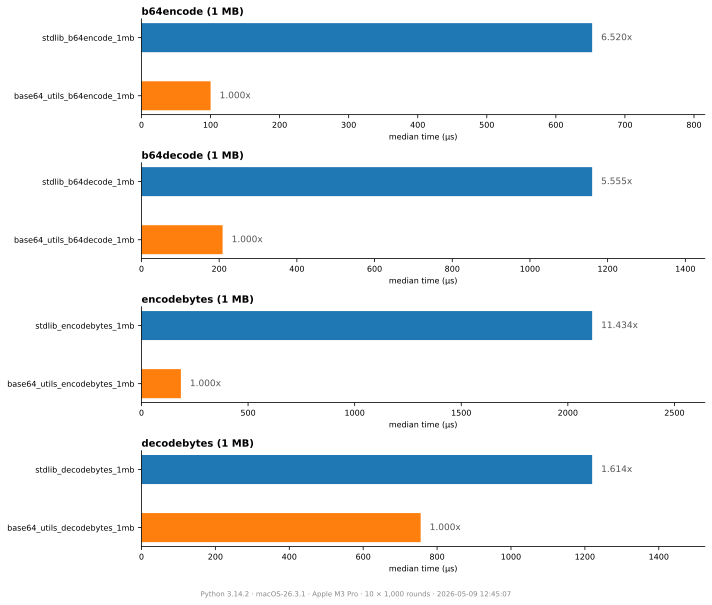

# Python base64 utils

<div align="center">

[](https://pypi.org/project/base64-utils/)
[](https://pypi.org/project/base64-utils)
[](https://codspeed.io/aminalaee/base64-utils?utm_source=badge)

</div>

---

Fast, drop-in replacement for Python's base64 module, powered by Rust.

## Installation
Using `pip`:
```shell
$ pip install base64-utils
```

## Example

```shell
>>> import base64_utils as base64

>>> encoded = base64.b64encode(b'data to be encoded')
>>> encoded
b'ZGF0YSB0byBiZSBlbmNvZGVk'

>>> data = base64.b64decode(encoded)
>>> data
b'data to be encoded'
```

## Benchmarks



```
╭──────────────────────────────────────── benchdiff ────────────────────────────────────────╮
│                                                                                           │
│   Benchmark                            Min           Median          Max           ×      │
│  ───────────────────────────────────────────────────────────────────────────────────────  │
│   b64encode (1 MB)                                                                        │
│     stdlib_b64encode_1mb            625.286µs      633.988µs      644.107µs     6.414x    │
│     base64_utils_b64encode_1mb       98.355µs       98.843µs       99.681µs     1.000x    │
│   b64decode (1 MB)                                                                        │
│     stdlib_b64decode_1mb            1118.293µs     1150.751µs     1544.677µs    5.627x    │
│     base64_utils_b64decode_1mb      202.354µs      204.514µs      218.525µs     1.000x    │
│   encodebytes (1 MB)                                                                      │
│     stdlib_encodebytes_1mb          2089.592µs     2152.850µs     2325.929µs    11.616x   │
│     base64_utils_encodebytes_1mb    184.732µs      185.340µs      191.616µs     1.000x    │
│   decodebytes (1 MB)                                                                      │
│     stdlib_decodebytes_1mb          1204.632µs     1220.026µs     1251.002µs    1.625x    │
│     base64_utils_decodebytes_1mb    743.156µs      750.587µs      760.377µs     1.000x    │
│                                                                                           │
│ ───────────────────────────────────────────────────────────────────────────────────────── │
│   Python      3.14.2                                                                      │
│   Platform    macOS-26.3.1                                                                │
│   CPU         Apple M3 Pro                                                                │
│   Rounds      10 × 1,000 calls                                                            │
│   Date        2026-05-09 12:46:18                                                         │
╰───────────────────────────────────────────────────────────────────────────────────────────╯
```

## How to develop locally

```shell
$ make build
$ make test
```
